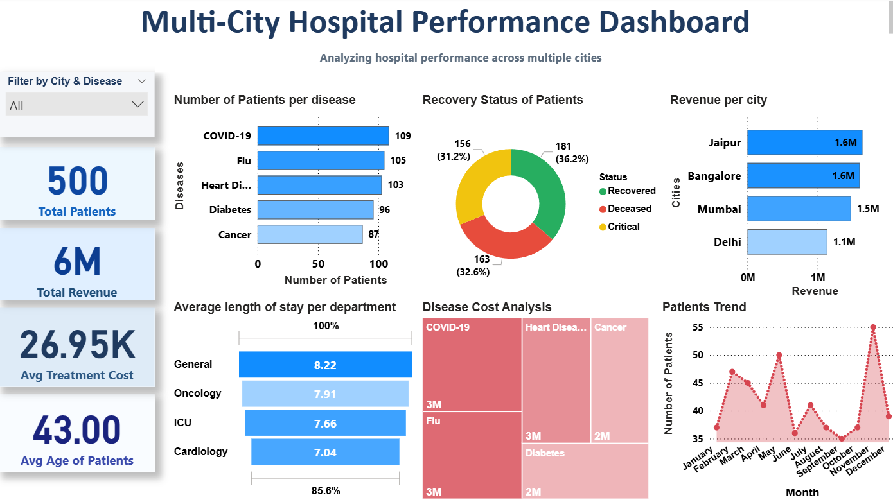

# 🏥 Multi-City Hospital Performance Dashboard

## 📊 Dashboard Preview

---

## 📄 Project Report

📥 Download the detailed project report here:  
[Healthcare Data Analytics Report](Healthcare_Data_Analytics_Report.pdf)

## 📌 Overview
This project focuses on analyzing healthcare data across multiple cities to evaluate hospital performance, patient trends, revenue, and treatment costs.

---

## 🛠️ Tools & Technologies
- Python (Pandas, NumPy)
- MySQL
- Power BI

---

## 📂 Project Workflow

1. **Data Creation**
   - Generated synthetic healthcare dataset using Python

2. **Data Cleaning & Processing**
   - Handled missing values
   - Created new features (Age Group, Final Bill)

3. **Data Analysis**
   - Performed analysis using Pandas & NumPy

4. **SQL Integration**
   - Connected processed data to MySQL
   - Performed queries for filtering and insights

5. **Data Visualization**
   - Built an interactive Power BI dashboard

---

## 📊 Dashboard Features

- KPI Metrics:
  - Total Patients
  - Total Revenue
  - Avg Treatment Cost
  - Avg Patient Age

- Visual Insights:
  - Revenue by City
  - Disease Distribution
  - Patient Outcome Analysis
  - Cost Analysis by Disease
  - Monthly Patient Trends
  - Payment Status Overview

- Filters:
  - City
  - Disease

---

## 📈 Key Insights

- Certain diseases contribute higher treatment costs
- Revenue varies significantly across cities
- Majority of patients fall under specific disease categories
- Payment status indicates pending revenue areas
- Monthly trends show variation in patient inflow

---

## 📁 Project Structure

